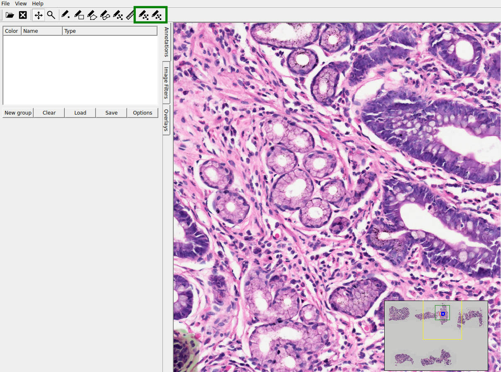

# ASAP – Fork with Gland Segmentation Wrappers and GUI Extensions

This repository is a fork of the original **ASAP (Automated Slide Analysis Platform)**, extended with new functionality to simplify **automatic segmentation of glands in whole-slide images (WSI)** using **AI models (SAM and U-Net)**.

👉 Original repo: [computationalpathologygroup/ASAP](https://github.com/computationalpathologygroup/ASAP)  
👉 This fork: [RiMoMa/ASAP](https://github.com/RiMoMa/ASAP)

---

## ✨ Key contributions in this fork

- **Two new buttons added to the GUI**:
  - Run automatic segmentation on the current WSI.  
  - Save results directly into ASAP-compatible `.xml` annotations.  

- **Python wrappers for AI models**:
  - `process_svs_and_generate_annotations.py`: batch segmentation of all `.svs` slides in a directory using **Segment Anything (SAM)**.  
  - `detect_glands_fov.py`: apply **SAM** on a single field of view (FOV).  
  - `detect_glands_unet_fov.py`: apply **U-Net** on a single FOV.  

- **Centralized configuration** via `scripts/config.json`:
  - Model checkpoints, encoder choice, tiling, thresholds, and postprocessing can be easily adjusted.  

- **ASAP XML integration**:
  - Segmentation results are stored as ASAP-readable `.xml` files.  
  - With `--show`, annotations accumulate visually in the viewer while the XML is updated after each run.  

---

## ⚙️ Build Instructions (Linux)

This fork was tested with **Ubuntu 20.04+** and **OpenSlide**.

```bash
mkdir build && cd build

cmake .. \
  -DCMAKE_BUILD_TYPE=Release \
  -DUSE_JPEG2000=OFF \
  -DBUILD_MULTIRESOLUTIONIMAGEINTERFACE_DICOM_SUPPORT=OFF \
  -DOPENSLIDE_INCLUDE_DIR=/usr/include/openslide \
  -DOPENSLIDE_LIBRARIES=/usr/lib/x86_64-linux-gnu/libopenslide.so \
  -DCMAKE_INSTALL_RPATH_USE_LINK_PATH=TRUE \
  -DBUILD_ASAP=ON

make -j"$(nproc)"
sudo make install
```

> The binary will be available as `ASAP`. On `.deb` installations, it is usually located under `/opt/ASAP/bin`.

---

## 🚀 Usage of the Wrappers

### 1. Configure `scripts/config.json`

Example snippet:

```json
{
  "model": "sam",
  "sam_checkpoint": "/path/to/sam_vit_h.pth",
  "unet_checkpoint": "/path/to/unet_glands.ckpt",
  "encoder": "resnet34",
  "postprocess": { "min_area": 200, "smooth_kernel": 3 },
  "tiling": { "patch_size": 1024, "overlap": 128 },
  "output": { "xml_dir": "./annotations", "format": "asap-xml" }
}
```

---

### 2. Process a folder of `.svs` files with SAM

```bash
python scripts/process_svs_and_generate_annotations.py \
  --input_dir /path/to/WSI \
  --config scripts/config.json \
  --output_dir ./annotations
```

---

### 3. Apply SAM on a single field of view (interactive)

```bash
python scripts/detect_glands_fov.py \
  --slide /path/to/case.svs \
  --x 10000 --y 12000 --w 4096 --h 4096 \
  --config scripts/config.json \
  --show
```

---

### 4. Apply U-Net on a single field of view

```bash
python scripts/detect_glands_unet_fov.py \
  --slide /path/to/case.svs \
  --x 5000 --y 5000 --w 4096 --h 4096 \
  --config scripts/config.json
```

---

## 🖼️ Screenshots / Examples


```markdown

*Two new buttons added for automatic segmentation and XML export.*


*Automatic gland segmentation using SAM, saved as ASAP XML annotations.*
```

Suggested screenshots to include:
- The ASAP GUI with the **two new buttons highlighted**.  
- Before vs. after automatic gland segmentation.  
- XML annotations overlaid in the viewer.  

---

## 📁 Project Structure

```
ASAP/
├─ build/                         
├─ scripts/
│  ├─ process_svs_and_generate_annotations.py
│  ├─ detect_glands_fov.py
│  ├─ detect_glands_unet_fov.py
│  ├─ config.json
├─ docs/img/                      # screenshots for the README
├─ annotations/                   # generated XMLs
└─ README.md
```

---

## 📄 License and Credits

- Original **ASAP** project: Computational Pathology Group.  
- This fork keeps the same license, with additional wrappers and GUI extensions for research and educational purposes.  
- Segmentation models: **SAM (Meta)** and **U-Net**.  

---

## 🙌 Acknowledgements

Thanks to the ASAP developers and the open-source community for providing the foundation for digital pathology research.

